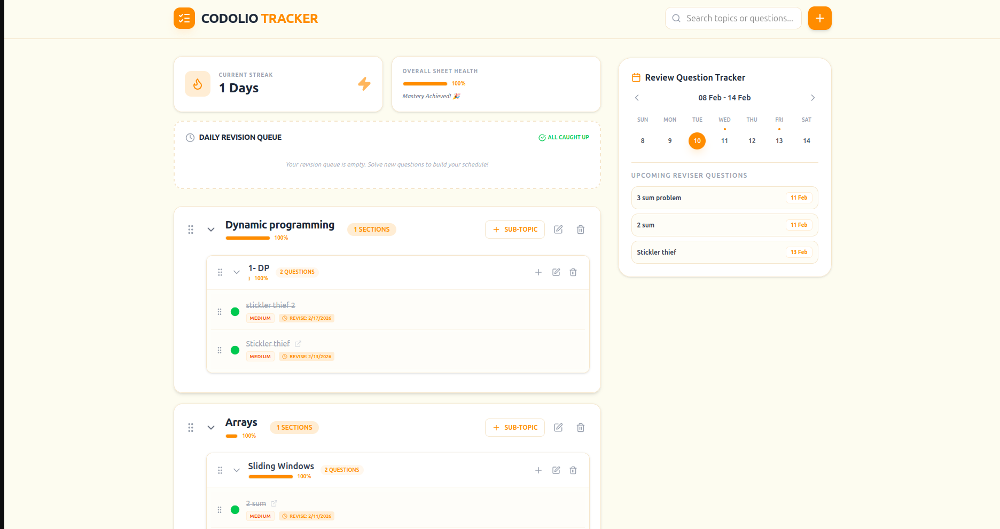

# Interactive Smart Question Sheet (Codolio Tracker)

An advanced, high-performance hierarchical Single Page Application (SPA) designed for students to organize, track, and master Data Structures and Algorithms (DSA) problems. Built with **React**, **Zustand**, and **Dnd-kit**, this tool integrates a sophisticated **Spaced Repetition (Reviser)** engine and a dynamic **Review Calendar**.

---
# 🚀 Interactive Smart Question Sheet (Codolio Tracker)


### 🔗 [Live Demo Link](https://your-live-link-here.vercel.app)

---

## 📸 Screenshots



---

## Core Features

### Hierarchical Management
* **Structured Organization**: Manage problems through a `Topic > Sub-Topic > Question` hierarchy, mirroring professional DSA platforms.
* **Dynamic Drag & Drop**: Fully interactive reordering of Topics, Sub-Topics, and Questions using `@dnd-kit`.
* **Expand/Collapse**: Maintain a clean workspace by toggling specific sections to focus on what matters.

### Spaced Repetition (The Reviser)
* **Intelligent Scheduling**: Logic-based revision triggers. Choose your "Solve Method" to automatically schedule the next review:
    * **Self**: 7 Days
    * **Hints**: 3 Days
    * **Solution**: 1 Day
* **Daily Queue**: A smart "Reviser" section at the top of the sheet automatically surfaces questions due for review today.

### Review Tracker Calendar
* **Visual Schedule**: A responsive calendar (Desktop: Right Sidebar | Mobile: Top Section) that marks upcoming review dates with high-visibility indicators.
* **Streak System**: Gamified consistency tracking with a visual streak counter to keep you motivated.

### Search & Progress Tracking
* **Global Search**: Instantly filter through hundreds of questions or topics in real-time.
* **Progress bar**: Granular percentage tracking for every Topic and Sub-Topic, providing immediate feedback on your mastery.

---

## Technical Stack

* **Frontend**: React.js (Vite)
* **State Management**: Zustand (with Persistence Middleware for Local Storage)
* **Drag & Drop**: `@dnd-kit` (Core, Sortable, Utilities)
* **Icons**: Lucide-React
* **Styling**: Tailwind CSS

---

## Getting Started

### Prerequisites
* Node.js (v16.x or higher)
* npm or yarn

### Installation
1.  **Clone the repository**:
    ```bash
    git clone [git@github.com:Prince1895/interactive-question-management-sheet.git](git@github.com:Prince1895/interactive-question-management-sheet.git)
    cd smart-question-sheet
    ```

2.  **Install dependencies**:
    ```bash
    npm install
    ```

3.  **Run the application**:
    ```bash
    npm run dev
    ```

4.  **Build for production**:
    ```bash
    npm run build
    ```

---

## Project Structure

```text
src/
├── components/
│   ├── Modal.jsx            # Reusable accessible portal for CRUD & Reviser
│   ├── Topic.jsx            # Hierarchical container & reorder logic
│   ├── SubTopic.jsx         # Nested section & sub-progress logic
│   ├── Question.jsx         # Question item & Reviser modal trigger
│   ├── ProgressBar.jsx      # Dynamic GFG-style progress visualizer
│   ├── Reviser.jsx          # Streak logic & Daily Queue dashboard
│   └── ReviewCalendar.jsx   # Spaced Repetition calendar visualization
├── store/
│   └── useQuestionStore.js  # Centralized state with Persistence
├── utils/
│   └── api.js               # External API mapping & transformation
└── App.jsx                  # Main Layout & Responsive Grid configuration
```

## Future Roadmap

### Social & Collaborative Learning
* **Live Collaboration**: Real-time "Study Rooms" using **WebSockets (Socket.io)** to solve problems and track progress simultaneously with teammates.
* **Shareable Sheets**: Generate unique public links to share your custom-curated question sets and study plans with the community.
* **Timed Battle Mode**: A competitive environment to solve specific sub-topics against friends to improve speed and accuracy under pressure.

### Aggregated Question Bank
* **Multi-Sheet Integration**: One-click import functionality for popular sheets like **Striver SDE Sheet**, **Love Babbar 450**, and **LeetCode 75**.
* **Cross-Sheet Drag & Drop**: Ability to pick questions from a global "Master Bank" and drop them directly into your personal revision sheets.
* **Must-Do Tagging**: Smart labeling for "High-Frequency" questions that appear across multiple famous curated lists (e.g., tagging a problem as "Essential" if it's in both Striver and Love Babbar).

### ⚡ Productivity & Deep Work
* **Focus Mode**: A distraction-free UI overlay that hides everything except the current problem, integrated with a customizable .
* **AI Hints**: Integrated **LLM (Large Language Model)** assistant to provide conceptual "nudges" and edge-case reminders without revealing the final solution.
